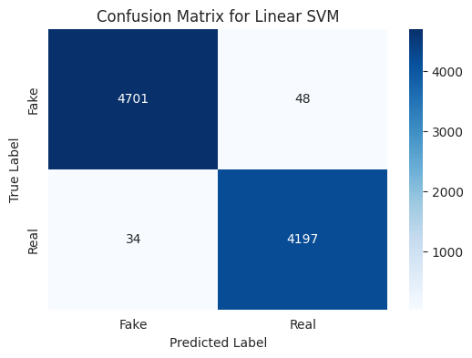
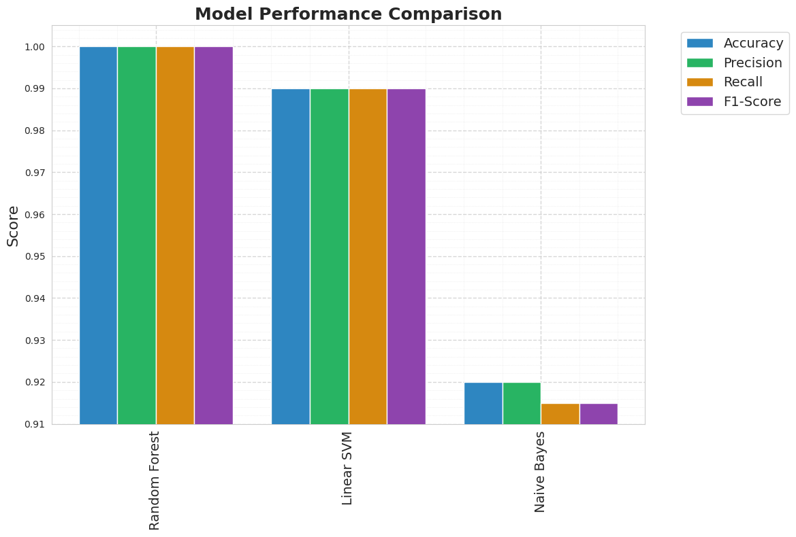

# 📰 Fake News Detection Using Machine Learning

This project uses machine learning models to classify news articles as **Fake** or **Real** using the [Kaggle Fake News dataset](https://www.kaggle.com/clmentbisaillon/fake-and-real-news-dataset). It includes data preprocessing, training multiple models, and evaluating their performance with visualizations.

---

## 📁 Dataset

The dataset contains two CSV files:

- `Fake.csv`: Fake news articles.
- `True.csv`: Real news articles.

Both files include:
- `title`
- `text`
- `subject`
- `date`

A new `label` column was added:  
- `0` → Fake  
- `1` → Real

---

## ⚙️ Preprocessing

- Combined both CSVs.
- Removed punctuation, stopwords, and non-alphabetic characters.
- Lowercased all text.
- Used `TfidfVectorizer` with various max_features (500, 1000, 5000) to analyze performance.
- Split data into train/test using an 80/20 split.

---

## 📊 Models Used

- ✅ **Random Forest**
- ✅ **Linear SVM**
- ✅ **Multinomial Naive Bayes**

Each model was evaluated using:
- Accuracy
- Precision
- Recall
- F1-Score
- Confusion Matrix

---

## 📈 Results Summary

| Model          | Accuracy | Precision | Recall | F1-Score |
|----------------|----------|-----------|--------|----------|
| Random Forest  | 1.00     | 1.00      | 1.00   | 1.00     |
| Linear SVM     | 0.99     | 0.99      | 0.99   | 0.99     |
| Naive Bayes    | 0.92     | 0.92      | 0.92   | 0.92     |

---

## 🧩 Confusion Matrices

Confusion matrices were plotted to visually compare misclassifications.

---

## 📊 Performance Bar Chart

Bar chart comparing all metrics across the three models.

---

## 🔧 Libraries Used

- `pandas`, `numpy`
- `scikit-learn`
- `matplotlib`, `seaborn`
- `nltk` (for text cleaning)

---

## 📌 Future Work

- Use deep learning models (LSTM, BERT).
- Include metadata (e.g., title and subject) in model input.

---

